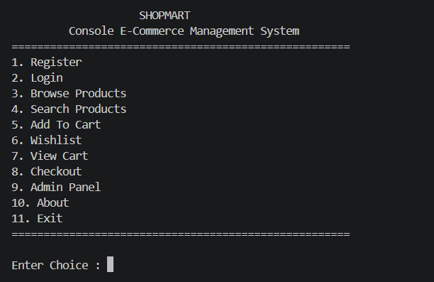
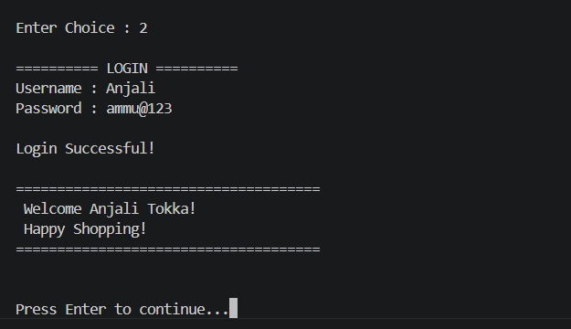
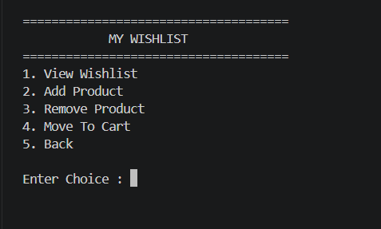
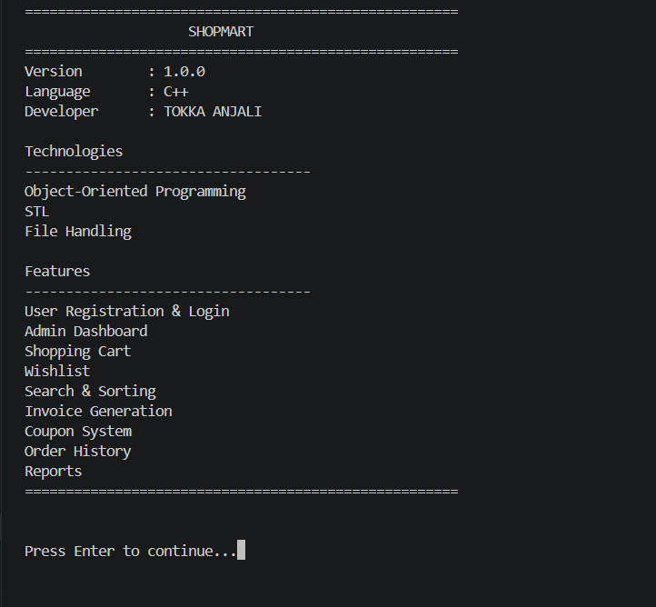

# 🛒 ShopMart - Console Based E-Commerce Management System

A feature-rich **Console-Based E-Commerce Management System** developed in **C++** using **Object-Oriented Programming (OOP)** principles. The application simulates a real-world online shopping platform with customer authentication, product management, shopping cart, wishlist, invoice generation, and an admin dashboard.

---

## 📌 Features

### 👤 User Module
- User Registration
- User Login Authentication
- Profile Information
- Secure Password Validation

### 🛍️ Product Module
- Browse Products
- Search Products
  - By Name
  - By Category
  - By Price Range
- Sort Products
  - Price (Low → High)
  - Price (High → Low)
  - Rating
  - Stock

### 🛒 Shopping Cart
- Add Products
- Remove Products
- View Cart
- Quantity Management
- GST Calculation
- Checkout

### ❤️ Wishlist
- Add to Wishlist
- Remove from Wishlist
- Move Products to Cart
- View Wishlist

### 🎟️ Coupon System
- Apply Coupon Codes
- Discount Calculation

### 📦 Order Management
- Place Orders
- Order History
- Auto-generated Order IDs

### 🧾 Invoice Generation
- Generate Invoice after Checkout
- Store Invoice as Text File

### 👨‍💼 Admin Module
- Admin Login
- Add Products
- Update Products
- Delete Products
- Search Products
- Low Stock Report
- Sales Report
- Dashboard Statistics

### 💾 File Handling
- Persistent Product Storage
- User Records
- Order Records
- Invoice Records
- Order ID Management

---

# 🛠️ Technologies Used

- C++
- Object-Oriented Programming
- Standard Template Library (STL)
- File Handling
- Modular Programming

---

# 🧩 OOP Concepts Implemented

- Encapsulation
- Inheritance
- Abstraction
- Polymorphism
- Modular Class Design

---

# 📂 Project Structure

```
SHOPMART
│
├── main.cpp
│
├── admin.cpp
├── admin.h
│
├── cart.cpp
├── cart.h
│
├── coupon.cpp
├── coupon.h
│
├── filemanager.cpp
├── filemanager.h
│
├── invoice.cpp
├── invoice.h
│
├── order.cpp
├── order.h
│
├── ordermanager.cpp
├── ordermanager.h
│
├── product.cpp
├── product.h
│
├── search.cpp
├── search.h
│
├── user.cpp
├── user.h
│
├── wishlist.cpp
├── wishlist.h
│
├── products.txt
├── users.txt
├── orders.txt
├── orderid.txt
│
├── screenshots/
│
└── README.md
```

---

# 📷 Screenshots

## 🏠 Home Screen



---

## 👤 Login



---

## 📦 Product Catalog


---

## 🔍 Product Search


---

## ❤️ Wishlist



---

## 🛒 Shopping Cart


---

## 💳 Checkout


---

## 👨‍💼 Admin Dashboard


---

## ℹ️ About



---

# 🚀 How to Run

### Compile

```bash
g++ *.cpp -o ShopMart
```

### Run

Windows

```bash
ShopMart.exe
```

Linux / macOS

```bash
./ShopMart
```

---

# 🎯 Future Enhancements

- Database Integration (MongoDB / MySQL)
- Payment Gateway Simulation
- Product Reviews
- Inventory Analytics
- Graphical User Interface (Qt / JavaFX)
- Email Notifications
- Multi-Admin Support

---

# 👩‍💻 Developer

**TOKKA ANJALI**

B.Tech Computer Science Student

---

## ⭐ If you like this project, consider giving it a star!
